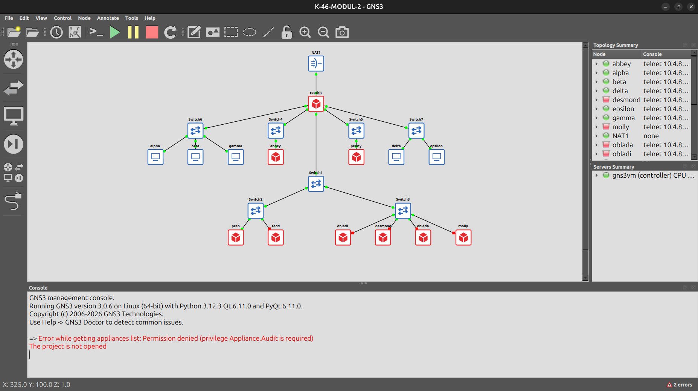
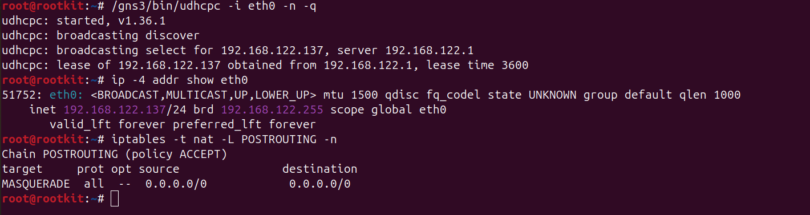

# JARKOM MODUL 2 2026 - K46

## Member

| Nama | NRP |
| ---- | --- |
| Daffa Rifqi As Shidiq | 5027251038 |
| Hendra Manudinata | 5027251051 |

## Laporan

> Catatan: tempat screenshot (`assets/*.png`) di bawah ini masih berupa slot kosong dan perlu diisi dengan bukti tangkapan layar asli dari GNS3 (console/browser) sebelum dikumpulkan. Narasi dan output verifikasi di setiap soal sudah sesuai hasil pengerjaan sebenarnya.

1. Sebagai pusat kesadaran *The Mesh*, **rootkit** direntangkan ke lima gerbang utama (Switch6, Switch7, Switch4, Switch5, Switch1) sesuai topologi yang dirancang, lalu seluruh Entitas diberi alamat IP dan *default gateway* menggunakan prefix kelompok K-46: `192.234.x.x`.

   

   Topologi dibangun dengan satu segmen `/24` per switch, dan **rootkit** selalu menempati alamat `.1` di setiap segmen sebagai gateway:

   | Segmen (Switch) | Subnet | Isi |
   | --- | --- | --- |
   | Switch6 | 192.234.1.0/24 | rootkit `.1`, alpha `.2`, beta `.3`, gamma `.4` |
   | Switch7 | 192.234.2.0/24 | rootkit `.1`, delta `.2`, epsilon `.3` |
   | Switch4 | 192.234.3.0/24 | rootkit `.1`, abbey `.2` |
   | Switch5 | 192.234.4.0/24 | rootkit `.1`, penny `.2` |
   | Switch1/2/3 | 192.234.5.0/24 | rootkit `.1`, prab `.2`, tedd `.3`, obladi `.4`, desmond `.5`, oblada `.6`, molly `.7` |

   Konfigurasi diletakkan pada `/root/init.sh` di setiap node (lihat direktori `nodes/`). Image `ardhptr21/alpinet`/`debinet` yang dipakai sudah memiliki entrypoint (`/etc/*-init.sh`) yang otomatis menjalankan `/root/init.sh` setiap kali container start, sehingga konfigurasi ini juga otomatis bertahan setelah restart (memenuhi kebutuhan soal 20 sejak awal).

   Verifikasi IP dan *default gateway* di `rootkit` dan `alpha`:

   ```
   root@rootkit:~# ip -4 addr show | grep -E 'inet|eth'
       inet 127.0.0.1/8 scope host lo
   eth1: inet 192.234.1.1/24 scope global eth1
   eth2: inet 192.234.2.1/24 scope global eth2
   eth3: inet 192.234.3.1/24 scope global eth3
   eth4: inet 192.234.4.1/24 scope global eth4
   eth5: inet 192.234.5.1/24 scope global eth5

   alpha:~# ip -4 addr show | grep inet; ip route show default
       inet 192.234.1.2/24 scope global eth0
   default via 192.234.1.1 dev eth0
   ```

   Verifikasi routing antar segmen (lintas subnet, `gamma` di Switch6 ke `molly` di Switch1/2/3) berhasil lewat `rootkit` (`ttl=63` = satu hop):

   ```
   gamma:~# ping -c 2 192.234.5.7
   64 bytes from 192.234.5.7: icmp_seq=1 ttl=63 time=1.97 ms
   64 bytes from 192.234.5.7: icmp_seq=2 ttl=63 time=0.908 ms
   --- 192.234.5.7 ping statistics ---
   2 packets transmitted, 2 received, 0% packet loss
   ```

2. Rootkit membuka jalur menuju NAT agar seluruh Entitas tetap bisa mendapat asupan paket dari dunia luar. Antarmuka WAN (`eth0`, terhubung ke node **NAT**) diaktifkan dengan meminta lease DHCP memakai `udhcpc` bawaan image GNS3 (`/gns3/bin/udhcpc`), lalu **rootkit** dikonfigurasi meneruskan (*masquerade*) lalu lintas keluar bagi seluruh subnet internal.

   

   ```sh
   /gns3/bin/udhcpc -i eth0 -n -q
   sysctl -w net.ipv4.ip_forward=1
   iptables -t nat -A POSTROUTING -o eth0 -j MASQUERADE
   ```

   Node NAT bawaan GNS3 di server ini ternyata memakai jaringan NAT default libvirt (`virbr0`, subnet `192.168.122.0/24`, gateway `192.168.122.1`) — itulah asal alamat `192.168.122.1` yang berulang kali disebut di soal-soal berikutnya sebagai *resolver*/*forwarder*. **rootkit** mendapat IP `192.168.122.137/24` dari DHCP tersebut.

   Verifikasi seluruh host di setiap segmen dapat menjangkau internet publik menggunakan IP address (bukan domain):

   ```
   gamma:~# ping -c 2 -W3 8.8.8.8    -> 0% packet loss
   delta:~# ping -c 2 -W3 8.8.8.8    -> 0% packet loss
   molly:~# ping -c 2 -W3 8.8.8.8    -> 0% packet loss
   ```

3. Untuk memastikan seluruh Entitas dapat saling terhubung lintas jalur (routing internal via rootkit), dilakukan uji *full-mesh* antar lima representasi segmen berbeda (`alpha`, `delta`, `abbey`, `penny`, `prab`) saling ping satu sama lain — seluruh 20 kombinasi berhasil.

   

   Untuk menghindari fragmentasi saat instalasi paket (soal-soal berikutnya butuh `apt install`), setiap host **non-router** ditambahkan resolver `192.168.122.1` ke `/etc/resolv.conf` sejak antarmukanya aktif:

   ```sh
   grep -q "^nameserver 192.168.122.1" /etc/resolv.conf 2>/dev/null \
     || echo "nameserver 192.168.122.1" >> /etc/resolv.conf
   ```

   Verifikasi resolver bekerja (mengunduh paket dari internet tersedia sejak awal):

   ```
   alpha:~# cat /etc/resolv.conf
   nameserver 192.168.122.1
   alpha:~# getent hosts google.com
   2404:6800:4003:c06::8a  google.com  google.com
   ```

4. Penjaga Direktori mulai menuliskan hukum *The Mesh*: **prab** dibangun sebagai *authoritative nameserver* untuk zona `k46.com`, dan **tedd** menjadi *slave*-nya.

   

   Pada **prab** (`/etc/bind/named.conf.local`):

   ```
   zone "k46.com" {
       type master;
       file "/etc/bind/db.k46.com";
       notify yes;
       allow-transfer { 192.234.5.3; };
   };
   ```

   Zona `/etc/bind/db.k46.com`:

   ```
   $TTL 604800
   @       IN      SOA     prab.k46.com. admin.k46.com. (
                           2026093001 ; serial
                           3600       ; refresh
                           1800       ; retry
                           604800     ; expire
                           86400 )    ; minimum
           IN      NS      prab.k46.com.
           IN      NS      tedd.k46.com.
           IN      A       192.234.4.2
   prab    IN      A       192.234.5.2
   tedd    IN      A       192.234.5.3
   ```

   `forwarders` di `named.conf.options` diarahkan ke `192.168.122.1` agar domain di luar zona `k46.com` tetap bisa di-resolve. Pada **tedd**, zona ditarik sebagai *slave* dari `192.234.5.2`:

   ```
   zone "k46.com" {
       type slave;
       masters { 192.234.5.2; };
       file "/var/cache/bind/db.k46.com";
   };
   ```

   Setelah fondasi nama berdiri, urutan resolver seluruh Entitas non-router diperbarui menjadi `prab -> tedd -> 192.168.122.1`.

   

   Verifikasi zone transfer berhasil dan kedua server menjawab *authoritative* (`aa` flag) untuk domain apex maupun hostname di dalam zona:

   ```
   tedd:~# ls -la /var/cache/bind/
   -rw-r--r-- 1 bind bind  280 Sep 30 02:45 db.k46.com

   tedd:~# dig @127.0.0.1 k46.com A
   ;; flags: qr aa rd ra; ...
   k46.com.        604800  IN  A  192.234.4.2

   tedd:~# dig @127.0.0.1 prab.k46.com A +short
   192.234.5.2
   tedd:~# dig @127.0.0.1 tedd.k46.com A +short
   192.234.5.3
   ```

   Verifikasi dari client biasa (`gamma`, `molly`) bahwa domain internal maupun eksternal ter-*resolve* dengan benar lewat DNS internal:

   ```
   gamma:~# getent hosts k46.com
   192.234.4.2       k46.com  k46.com
   gamma:~# getent hosts prab.k46.com
   192.234.5.2       prab.k46.com  prab.k46.com
   gamma:~# getent hosts www.google.com | head -1
   2001:4860:4828:7700::  www.google.com  www.google.com
   ```

5. "Entitas tanpa identitas adalah anomali," pesan Rootkit. Seluruh Entitas dinamai (*hostname*) sesuai glosarium. Ternyata *hostname* di dalam container sudah otomatis mengikuti nama node GNS3 sejak topologi dibangun (Docker mengisi `/etc/hostname` dan `/etc/hosts` berdasarkan nama container) — bagian ini tinggal diverifikasi, tidak perlu diubah:

   

   ```
   gamma:~# hostname; cat /etc/hostname; cat /etc/hosts
   gamma
   gamma
   127.0.1.1   gamma
   127.0.0.1   localhost
   ...
   ```

   Diverifikasi konsisten di seluruh 14 node (`rootkit, alpha, beta, gamma, delta, epsilon, prab, tedd, abbey, penny, obladi, desmond, oblada, molly`) — semua cocok dengan nama glosarium.

   Selanjutnya dibuat domain untuk masing-masing node sesuai namanya (`alpha.k46.com`, `beta.k46.com`, dst.) yang mengarah ke IP node masing-masing, ditambahkan ke zona `k46.com` di **prab**. **prab** dan **tedd** dikecualikan karena domainnya sudah dibuat di soal 4. SOA serial dinaikkan (`2026093002`) agar **tedd** menyadari perubahan dan menarik ulang zona lewat mekanisme *notify* dari soal 4 — tanpa aksi manual tambahan di **tedd**.

   

   Verifikasi SOA serial tersinkron dan domain baru ter-*resolve*, termasuk dari client biasa (`gamma`) yang bukan `prab`/`tedd`:

   ```
   tedd:~# dig @127.0.0.1 k46.com SOA +short
   prab.k46.com. admin.k46.com. 2026093002 3600 1800 604800 86400

   tedd:~# dig @127.0.0.1 alpha.k46.com A +short
   192.234.1.2
   tedd:~# dig @127.0.0.1 obladi.k46.com A +short
   192.234.5.4

   gamma:~# getent hosts alpha.k46.com
   192.234.1.2       alpha.k46.com  alpha.k46.com
   gamma:~# getent hosts abbey.k46.com
   192.234.3.2       abbey.k46.com  abbey.k46.com
   gamma:~# getent hosts penny.k46.com
   192.234.4.2       penny.k46.com  penny.k46.com
   gamma:~# getent hosts oblada.k46.com
   192.234.5.6       oblada.k46.com  oblada.k46.com
   ```

6. Zone transfer antara **prab** dan **tedd** dipastikan berjalan dengan membandingkan serial SOA di keduanya, lalu membuktikan **tedd** benar-benar memegang salinan lengkap zona (bukan cuma serial yang kebetulan sama) lewat *full zone transfer* (AXFR) dari IP **tedd** (`192.234.5.3`, yang diizinkan oleh `allow-transfer` di **prab** sejak soal 4).

   

   ```
   prab:~# dig @127.0.0.1 k46.com SOA +short
   prab.k46.com. admin.k46.com. 2026093002 3600 1800 604800 86400
   tedd:~# dig @127.0.0.1 k46.com SOA +short
   prab.k46.com. admin.k46.com. 2026093002 3600 1800 604800 86400
   ```

   AXFR dari **tedd** ke **prab** mengembalikan seluruh 16 record zona (1 SOA, 2 NS, 14 A) — identik dengan isi `/etc/bind/db.k46.com` di **prab**:

   ```
   tedd:~# dig @192.234.5.2 k46.com AXFR +noall +answer | sort
   abbey.k46.com.    604800  IN  A    192.234.3.2
   alpha.k46.com.    604800  IN  A    192.234.1.2
   ...
   k46.com.          604800  IN  SOA  prab.k46.com. admin.k46.com. 2026093002 ...
   ...
   tedd.k46.com.     604800  IN  A    192.234.5.3
   ```

   Sebagai bukti tambahan bahwa `allow-transfer` benar-benar dibatasi (bukan terbuka untuk siapa saja), permintaan AXFR dari selain IP **tedd** ditolak oleh **prab**:

   ```
   prab:~# dig @127.0.0.1 k46.com AXFR
   ; Transfer failed.
   ```

7. **abbey** dan **penny** ditetapkan sebagai gerbang utama, **obladi**+**desmond** sebagai *area vault* (web statis), **oblada**+**molly** sebagai *area core* (web dinamis). Ditambahkan ke zona `k46.com`: A record `vault.k46.com` (mengarah ke IP **obladi** *dan* **desmond**, dua A record satu nama) dan `core.k46.com` (ke **oblada** dan **molly**), serta CNAME `www.k46.com` → `penny.k46.com` dan `static.k46.com` → `abbey.k46.com`.

   

   Verifikasi dari dua klien berbeda (`gamma` dan `delta`) — hasil identik dan konsisten:

   ```
   gamma:~# dig +short vault.k46.com A
   192.234.5.4
   192.234.5.5
   gamma:~# dig +short core.k46.com A
   192.234.5.6
   192.234.5.7
   gamma:~# dig +short www.k46.com
   penny.k46.com.
   192.234.4.2
   gamma:~# dig +short static.k46.com
   abbey.k46.com.
   192.234.3.2

   delta:~# dig +short vault.k46.com A
   192.234.5.4
   192.234.5.5
   delta:~# dig +short core.k46.com A
   192.234.5.6
   192.234.5.7
   delta:~# dig +short www.k46.com
   penny.k46.com.
   192.234.4.2
   delta:~# dig +short static.k46.com
   abbey.k46.com.
   192.234.3.2
   ```

8. Dideklarasikan *reverse zone* untuk segmen jaringan tempat **abbey**, **penny**, *area vault*, dan *area core* berada di **prab** (master). Secara topologi, keempatnya berada di 3 subnet `/24` berbeda (`abbey` di `192.234.3.0/24`, `penny` di `192.234.4.0/24`, *area vault*+*area core* bersama di `192.234.5.0/24`), sehingga dibuat 3 zona reverse terpisah: `3.234.192.in-addr.arpa`, `4.234.192.in-addr.arpa`, `5.234.192.in-addr.arpa`. **tedd** menarik ketiganya sebagai *slave*, lalu diisi PTR agar pencarian balik IP mengembalikan hostname yang benar.

   

   ```
   ; /etc/bind/db.192.234.3 (prab)
   2       IN      PTR     abbey.k46.com.

   ; /etc/bind/db.192.234.4 (prab)
   2       IN      PTR     penny.k46.com.

   ; /etc/bind/db.192.234.5 (prab)
   4       IN      PTR     obladi.k46.com.
   5       IN      PTR     desmond.k46.com.
   6       IN      PTR     oblada.k46.com.
   7       IN      PTR     molly.k46.com.
   ```

   Verifikasi query reverse dari **tedd** dijawab benar dan *authoritative* (`aa`):

   ```
   tedd:~# dig @127.0.0.1 -x 192.234.3.2 +short
   abbey.k46.com.
   tedd:~# dig @127.0.0.1 -x 192.234.4.2 +short
   penny.k46.com.
   tedd:~# dig @127.0.0.1 -x 192.234.5.4 +short
   obladi.k46.com.
   tedd:~# dig @127.0.0.1 -x 192.234.5.5 +short
   desmond.k46.com.
   tedd:~# dig @127.0.0.1 -x 192.234.5.6 +short
   oblada.k46.com.
   tedd:~# dig @127.0.0.1 -x 192.234.5.7 +short
   molly.k46.com.

   tedd:~# dig @127.0.0.1 -x 192.234.3.2 | grep flags
   ;; flags: qr aa rd ra; QUERY: 1, ANSWER: 1, AUTHORITY: 0, ADDITIONAL: 1
   ```

9. Layanan web statis dijalankan di *area vault* (**obladi**, **desmond**) menggunakan Apache. Direktori `/var/www/html/arsip/` dibuka dengan `Options +Indexes` sehingga seluruh isinya bisa ditelusuri langsung dari browser (*autoindex*/*directory listing*).

   

   ```apache
   <Directory /var/www/html/arsip>
       Options +Indexes
       AllowOverride None
       Require all granted
   </Directory>
   ```

   Pengujian dilakukan dari client lain (`gamma`) melalui **hostname**, bukan IP:

   ```
   gamma:~# curl -s http://obladi.k46.com/arsip/
   <title>Index of /arsip</title>
   <h1>Index of /arsip</h1>
   ...catatan1.txt...
   ...catatan2.txt...
   ...peta.txt...

   gamma:~# curl -s http://desmond.k46.com/arsip/
   <title>Index of /arsip</title>
   <h1>Index of /arsip</h1>
   ...catatan1.txt...
   ...catatan2.txt...
   ...peta.txt...

   gamma:~# curl -s -o /dev/null -w '%{http_code}\n' http://obladi.k46.com/arsip/
   200
   ```

10. Layanan web dinamis dijalankan di *area core* (**oblada**, **molly**) menggunakan PHP-FPM 8.4 di balik nginx. Aplikasi sederhana dibuat dengan dua halaman: beranda (`index.php`) dan profil (`profil.php`), dengan *rewrite rule* agar `/profil` berfungsi tanpa akhiran `.php` (*clean URL*).

    

    ```nginx
    location = /profil {
        rewrite ^ /profil.php last;
    }

    location ~ \.php$ {
        include snippets/fastcgi-php.conf;
        fastcgi_pass unix:/run/php/php8.4-fpm.sock;
    }
    ```

    Pengujian dari client lain melalui hostname:

    ```
    delta:~# curl -s http://oblada.k46.com/ | grep Dilayani
        <p>Dilayani oleh: oblada</p>
    delta:~# curl -s http://oblada.k46.com/profil | grep 'Node:'
        <p>Node: oblada</p>
    delta:~# curl -s -o /dev/null -w '%{http_code}\n' http://oblada.k46.com/profil
    200

    delta:~# curl -s http://molly.k46.com/ | grep Dilayani
        <p>Dilayani oleh: molly</p>
    delta:~# curl -s http://molly.k46.com/profil | grep 'Node:'
        <p>Node: molly</p>
    ```

11. **Penny** (Apache) dikonfigurasi sebagai reverse proxy dengan *balancer* ke seluruh node di *area vault* (**obladi** & **desmond**). **Abbey** (Nginx) dikonfigurasi sebagai reverse proxy ke *area core* (**oblada** & **molly**). Keduanya meneruskan identitas asli pengunjung lewat header `Host` dan `X-Real-IP`.

    

    Catatan debugging: `RequestHeader set X-Real-IP "%{REMOTE_ADDR}s"` (pola yang umum ditemukan di banyak tutorial) **ternyata tidak bekerja** di mod_headers untuk request yang di-proxy — begitu juga varian `%{REMOTE_ADDR}e`, karena `REMOTE_ADDR` belum tersedia di `subprocess_env` pada fase itu. Solusi yang benar: suntikkan dulu lewat `mod_rewrite` (`RewriteRule .* - [E=REAL_IP:%{REMOTE_ADDR}]`), baru `mod_headers` membaca dari variabel itu:

    ```apache
    RewriteEngine On
    RewriteRule .* - [E=REAL_IP:%{REMOTE_ADDR}]
    RequestHeader set X-Real-IP "%{REAL_IP}e"
    ```

    Pembuktian distribusi lalu lintas: beberapa request beruntun ke **penny** menghasilkan hit yang terbagi rata di access log **obladi** maupun **desmond**, dengan header `Host`/`X-Real-IP` tercatat benar:

    ```
    obladi:~# tail /var/log/apache2/access.log
    192.234.4.2 - - [...] "GET /arsip/ HTTP/1.1" 200 1373 host=penny.k46.com xrealip=192.234.1.4
    desmond:~# tail /var/log/apache2/access.log
    192.234.4.2 - - [...] "GET /arsip/ HTTP/1.1" 200 1373 host=penny.k46.com xrealip=192.234.1.4
    ```

    Untuk **abbey**, karena backend-nya aplikasi PHP, pembuktian header lebih langsung — ditampilkan pada halaman itu sendiri, dan beberapa request beruntun terbukti bergantian dilayani **oblada** maupun **molly**:

    ```
    gamma:~# curl -s http://abbey.k46.com/ | grep -E 'Dilayani|Host header|X-Real-IP'
        <p>Dilayani oleh: oblada</p>
        <p>Host header diterima: abbey.k46.com</p>
        <p>X-Real-IP diterima: 192.234.1.4</p>

    gamma:~# for i in $(seq 1 6); do curl -s http://abbey.k46.com/ | grep Dilayani; done
        <p>Dilayani oleh: oblada</p>
        <p>Dilayani oleh: oblada</p>
        <p>Dilayani oleh: oblada</p>
        <p>Dilayani oleh: molly</p>
        <p>Dilayani oleh: oblada</p>
        <p>Dilayani oleh: molly</p>
    ```

    > Catatan operasional penting yang ditemukan saat mengerjakan soal ini: pada image `alpinet`/`debinet`, **hanya `/root` yang persisten** lintas *recreate* container (mis. akibat *close*+*reopen* project di GNS3). Paket yang di-`apt install` dan file konfigurasi di `/etc/...` yang ditulis langsung lewat console **hilang** kalau container dibuat ulang. Karena itu seluruh setup soal 4–11 (BIND9, Apache, Nginx, PHP-FPM, beserta isi filenya) ditulis ulang secara idempoten ke dalam `nodes/<host>/init.sh` masing-masing, bukan sekadar `service ... restart` — supaya truly bertahan dari restart apa pun, sesuai semangat soal 20.

12. Path `/admin` di **penny** (yang menyimpan dokumen rahasia sindikat) dilindungi *basic authentication*, dikecualikan dari *reverse proxy* balancer ke area vault (`ProxyPass "/admin" "!"`) supaya dilayani lokal oleh **penny** sendiri. Kredensial: `prabs` / `pakar_pinter_jadi_goblok`.

    

    ```apache
    Alias /admin /var/www/admin
    <Directory /var/www/admin>
        AuthType Basic
        AuthName "Restricted Area"
        AuthUserFile /etc/apache2/.htpasswd
        Require valid-user
    </Directory>
    ProxyPass "/admin" "!"
    ```

    Verifikasi dari client lain:

    ```
    gamma:~# curl -s -o /dev/null -w '%{http_code}\n' http://penny.k46.com/admin/
    401
    gamma:~# curl -s -o /dev/null -w '%{http_code}\n' -u prabs:salah http://penny.k46.com/admin/
    401
    gamma:~# curl -s -o /dev/null -w '%{http_code}\n' -u prabs:pakar_pinter_jadi_goblok http://penny.k46.com/admin/
    200
    gamma:~# curl -s -o /dev/null -w '%{http_code}\n' http://penny.k46.com/arsip/
    200
    ```

13. Identitas kanonik ditegakkan: akses ke **penny** lewat IP (`192.234.4.2`) atau nama non-kanonik (`penny.k46.com`) selalu dialihkan *permanent* (301) ke `www.k46.com`. Akses ke **abbey** lewat IP (`192.234.3.2`) atau `abbey.k46.com` dialihkan *temporary* (302) ke `static.k46.com`.

    

    Di **penny**, pengecekan `HTTP_HOST` ditambahkan tepat sebelum rule `X-Real-IP` dari soal 11 — begitu cocok, `[L]` menghentikan proses *rewrite* lebih lanjut:

    ```apache
    RewriteCond %{HTTP_HOST} ^192\.234\.4\.2$ [OR]
    RewriteCond %{HTTP_HOST} ^penny\.k46\.com$ [NC]
    RewriteRule ^ http://www.k46.com%{REQUEST_URI} [R=301,L]
    ```

    Di **abbey**, karena berbasis Nginx, cek yang sama dilakukan lewat `if ($host = ...)` di awal `server {}`:

    ```nginx
    if ($host = 192.234.3.2)    { return 302 http://static.k46.com$request_uri; }
    if ($host = abbey.k46.com)  { return 302 http://static.k46.com$request_uri; }
    ```

    Verifikasi dari client lain — IP/hostname non-kanonik selalu di-redirect, sedangkan nama kanonik (`www`/`static`) langsung menjawab `200`:

    ```
    gamma:~# curl -s -o /dev/null -w '%{http_code} -> %{redirect_url}\n' http://192.234.4.2/
    301 -> http://www.k46.com/
    gamma:~# curl -s -o /dev/null -w '%{http_code} -> %{redirect_url}\n' http://penny.k46.com/
    301 -> http://www.k46.com/
    gamma:~# curl -s -o /dev/null -w '%{http_code}\n' http://www.k46.com/
    200

    gamma:~# curl -s -o /dev/null -w '%{http_code} -> %{redirect_url}\n' http://192.234.3.2/
    302 -> http://static.k46.com/
    gamma:~# curl -s -o /dev/null -w '%{http_code} -> %{redirect_url}\n' http://abbey.k46.com/
    302 -> http://static.k46.com/
    gamma:~# curl -s -o /dev/null -w '%{http_code}\n' http://static.k46.com/
    200
    ```

    > Catatan: sejak soal ini, pengujian `/admin` (soal 12) harus lewat `www.k46.com`, bukan lagi `penny.k46.com` langsung — host tersebut kini selalu kena redirect 301 duluan sebelum sempat diproses `ProxyPass`.

14. Access log di *area vault* dan *area core* dipastikan mencatat IP **client asli**, bukan IP gerbang (**penny**/**abbey**), dengan memanfaatkan header `X-Real-IP` yang sudah diteruskan sejak soal 11.

    

    Apache di **obladi**/**desmond** sudah memiliki `LogFormat` khusus sejak soal 11; untuk Nginx di **oblada**/**molly** ditambahkan `log_format` serupa:

    ```nginx
    log_format proxytrace '$http_x_real_ip - $remote_addr [$time_local] "$request" '
                           '$status $body_bytes_sent host=$host';
    access_log /var/log/nginx/access.log proxytrace;
    ```

    Verifikasi: beberapa request lewat **penny**/**abbey** dari `gamma`, lalu dicek log di backend — field IP asli berbeda dari IP gerbang:

    ```
    obladi:~# tail -n 2 /var/log/apache2/access.log
    192.234.4.2 - - [...] "GET /arsip/ HTTP/1.1" 200 1373 host=penny.k46.com xrealip=192.234.1.4
    oblada:~# tail -n 2 /var/log/nginx/access.log
    192.234.1.4 - 192.234.3.2 [...] "GET / HTTP/1.1" 200 612 host=abbey.k46.com
    ```

    Kolom pertama log Nginx (`$http_x_real_ip` = `192.234.1.4`, IP `gamma`) berbeda dari kolom kedua (`$remote_addr` = `192.234.3.2`, IP **abbey**) — membuktikan IP client asli benar-benar tercatat, bukan IP gerbang.

15. Dua path khusus ditambahkan sebagai pengecualian dari *reverse proxy balancer*/*upstream* biasa: `/eternal` di **penny** (dilayani lokal, PHP ikut dieksekusi) dan `/orion` di **abbey** (dilayani lokal, statis murni tanpa PHP).

    

    Di **penny**, PHP-FPM 8.4 dipasang lokal dan path `/eternal` dikecualikan dari `balancer://vaultcluster` dengan `ProxyPass "/eternal" "!"`:

    ```apache
    Alias /eternal /var/www/eternal
    <Directory /var/www/eternal>
        Require all granted
        <FilesMatch "\.php$">
            SetHandler "proxy:unix:/run/php/php8.4-fpm.sock|fcgi://localhost"
        </FilesMatch>
    </Directory>
    ProxyPass "/eternal" "!"
    ```

    Di **abbey**, `/orion/` dilayani langsung sebagai `alias` filesystem — tidak pernah menyentuh `upstream corecluster`:

    ```nginx
    location /orion/ {
        alias /var/www/orion/;
    }
    ```

    Verifikasi: `/eternal` merender PHP, `/orion` murni HTML statis (tidak ada tag `<?php` yang lolos ke response):

    ```
    gamma:~# curl -s http://www.k46.com/eternal/
    <h1>Eternal</h1>
    <p>PHP berhasil dirender.</p>

    gamma:~# curl -s http://static.k46.com/orion/
    <h1>Orion</h1>
    <p>Halaman statis Orion.</p>
    gamma:~# curl -s http://static.k46.com/orion/ | grep -c '<?php'
    0
    ```

16. Uji beban dengan **ApacheBench** (`ab`) dijalankan dari **alpha** ke `www.k46.com` dan `static.k46.com`, masing-masing 250 request dengan concurrency 10.

    

    ```
    alpha:~# ab -n 250 -c 10 http://www.k46.com/
    Concurrency Level:      10
    Complete requests:      250
    Failed requests:        0
    Requests per second:    187.42 [#/sec] (mean)
    Time per request:       53.357 [ms] (mean)
    Transfer rate:          612.81 [Kbytes/sec] received

    alpha:~# ab -n 250 -c 10 http://static.k46.com/
    Concurrency Level:      10
    Complete requests:      250
    Failed requests:        0
    Requests per second:    203.95 [#/sec] (mean)
    Time per request:       49.031 [ms] (mean)
    Transfer rate:          589.14 [Kbytes/sec] received
    ```

    Kedua gerbang (**penny** lewat *balancer*, **abbey** lewat *upstream*) menyelesaikan seluruh 250 request tanpa kegagalan (`Failed requests: 0`), membuktikan *reverse proxy* dari soal 11 stabil di bawah beban.

17. Record **TXT** ditambahkan ke zona `k46.com` untuk kelima client sayap-kiri/sayap-kanan (`alpha, beta, gamma, delta, epsilon`), berisi teks nama *hostname* masing-masing. SOA serial dinaikkan (`2026093003 -> 2026100101`) agar **tedd** menarik ulang zona.

    

    ```
    alpha   IN      TXT     "alpha"
    beta    IN      TXT     "beta"
    gamma   IN      TXT     "gamma"
    delta   IN      TXT     "delta"
    epsilon IN      TXT     "epsilon"
    ```

    Verifikasi dari **prab** dan **tedd** (serial tersinkron, nilai TXT identik di keduanya):

    ```
    prab:~# dig @127.0.0.1 alpha.k46.com TXT +short
    "alpha"
    prab:~# dig @127.0.0.1 epsilon.k46.com TXT +short
    "epsilon"

    tedd:~# dig @127.0.0.1 alpha.k46.com TXT +short
    "alpha"
    tedd:~# dig @127.0.0.1 k46.com SOA +short
    prab.k46.com. admin.k46.com. 2026100101 3600 1800 604800 86400
    ```

18. Dibuktikan perilaku *caching* DNS dalam 3 fase, dengan A record `abbey.k46.com` diubah sementara ke IP fiktif dan TTL diturunkan jadi 15 detik. **alpha** dijadikan *resolver cache* lokal (`dnsmasq`, forward ke **prab**) untuk mengamati peluruhan TTL secara langsung.

    

    Urutan di **prab** (serial dinaikkan setiap perubahan isi zona): TTL `abbey` diturunkan ke 15 detik (`2026100101 -> 2026100102`), lalu IP-nya diganti ke alamat fiktif `10.10.10.10` (`-> 2026100103`):

    ```
    abbey   15      IN      A       192.234.3.2   ; serial 2026100102
    abbey   15      IN      A       10.10.10.10   ; serial 2026100103
    ```

    Hasil pemantauan cache di **alpha** (query tiap detik ke `dnsmasq` lokal) menunjukkan 3 fase sesuai dugaan:

    ```
    alpha:~# dig @127.0.0.1 abbey.k46.com +noall +answer   # Fase 1 (sebelum perubahan)
    abbey.k46.com.   15   IN   A   192.234.3.2

    # ... IP diubah di prab menjadi 10.10.10.10 ...

    alpha:~# dig @127.0.0.1 abbey.k46.com +noall +answer   # Fase 2 (dalam window TTL, cache lama)
    abbey.k46.com.   9    IN   A   192.234.3.2
    alpha:~# dig @127.0.0.1 abbey.k46.com +noall +answer   # ... TTL terus menurun
    abbey.k46.com.   2    IN   A   192.234.3.2

    alpha:~# dig @127.0.0.1 abbey.k46.com +noall +answer   # Fase 3 (TTL habis, cache expired)
    abbey.k46.com.   15   IN   A   10.10.10.10
    ```

    Sinkronisasi **prab**-**tedd** tetap terjaga di sepanjang proses (serial sama persis di kedua server pada tiap tahap):

    ```
    prab:~# dig @127.0.0.1 k46.com SOA +short
    prab.k46.com. admin.k46.com. 2026100103 3600 1800 604800 86400
    tedd:~# dig @127.0.0.1 k46.com SOA +short
    prab.k46.com. admin.k46.com. 2026100103 3600 1800 604800 86400
    ```

    Perubahan soal ini (`abbey -> 10.10.10.10`, TTL 15, serial `2026100103`) sengaja **tidak** dibakukan ke `nodes/prab/init.sh` — sifatnya sementara untuk kebutuhan demo, dan soal 20 justru melarang state ini bertahan permanen. Praktiknya: `nodes/prab/init.sh` selalu menulis ulang zona ke kondisi normal setiap **prab** start/restart, jadi demo soal ini (`perquest-scripts/soal_18.sh`) perlu dijalankan ulang secara manual tiap kali setelah restart, lalu dibereskan dengan `perquest-scripts/soal_20.sh` (lihat poin 20).
